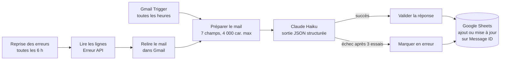

# mailsort-ai : tri automatique des mails Gmail avec Claude et n8n

Un agent qui lit mes nouveaux mails Gmail toutes les heures, demande à Claude de
les classer, de les prioriser et de les résumer, puis écrit une ligne par mail dans
un Google Sheet. Le matin, je lis le tableau au lieu de trier ma boîte de réception.

En production sur n8n Cloud depuis le 8 octobre 2026.

## Le problème

Une boîte de réception mélange les demandes de clients, les factures, les alertes
techniques et les newsletters. Trier tout ça à la main prend du temps, et un mail
important peut se perdre au milieu.

## Le résultat

Chaque mail devient une ligne de tableau, filtrable par catégorie et par priorité.
Exemple avec des **données fictives** ([`exemples/exemple-sheet.csv`](exemples/exemple-sheet.csv)) :

| Date | Expéditeur | Objet | Catégorie | Priorité | Résumé | Action |
|---|---|---|---|---|---|---|
| 2026-10-08 08:12 | Julie Martin | Devis refonte site Next.js | Client / Mission | haute | Julie demande un devis pour refondre le site de sa boutique en Next.js avant vendredi. | Envoyer le devis avant vendredi |
| 2026-10-08 08:47 | Azure | Alerte : quota de stockage à 90 % | Notification | moyenne | Azure signale que le compte de stockage de test atteint 90 % de son quota. | Vérifier le compte de stockage |
| 2026-10-08 09:05 | Hébergeur Exemple | Votre facture d'octobre | Facture / Paiement | basse | L'hébergeur envoie la facture mensuelle de 12 € payée automatiquement. | |
| 2026-10-08 09:31 | Thomas Leroy | Point sur le ticket API | Action requise | haute | Thomas demande un point aujourd'hui sur le ticket d'erreurs 401 de l'API. | Répondre à Thomas pour fixer un créneau |
| 2026-10-08 10:14 | La Lettre Dev | Les nouveautés de Node.js 24 | Newsletter | basse | Newsletter sur les nouveautés de Node.js 24 et de npm. | |

Le tableau complet a aussi les colonnes Email, Lien (ouvre le mail dans Gmail),
Message ID, Traité le et Statut (rempli à la main).

## Comment ça marche

1. **Gmail Trigger** : interroge la boîte de réception toutes les heures, sans les
   onglets Promotions et Réseaux sociaux (`in:inbox -category:promotions -category:social`).
2. **Préparer le mail** : garde l'expéditeur, l'objet, la date et le texte brut,
   coupé à 4 000 caractères pour limiter le coût.
3. **Claude** : un appel à l'API Anthropic (`claude-haiku-5-5`) renvoie la catégorie
   (parmi 9), la priorité (haute, moyenne, basse), un résumé et l'action à faire.
4. **Valider la réponse** : vérifie le JSON, formate les dates (Europe/Paris) et
   construit le lien vers le mail.
5. **Google Sheets** : ajoute la ligne, ou la met à jour si le mail est déjà présent.

Un second workflow (`workflow-alerte.json`) m'envoie un mail si le workflow
principal tombe en panne.

## Choix techniques

| Sujet | Choix | Pourquoi |
|---|---|---|
| Format de réponse | Sorties structurées de l'API (JSON Schema avec listes fermées) | L'API garantit un JSON valide et une catégorie connue : pas de parsing fragile. |
| Injection de prompt | Le mail est placé entre balises `<email>` et le prompt dit d'ignorer toute consigne qu'il contient | Un mail ne peut pas changer le comportement du classement. |
| Doublons | Clé unique sur l'ID Gmail du message | Un mail relu deux fois met à jour sa ligne au lieu de la recopier. |
| Pannes de l'API | Sortie d'erreur par mail, puis reprise automatique toutes les 6 h | Un mail en échec n'arrête plus tout le lot et il est retraité plus tard. |
| Injection de formules | Écriture en mode `RAW` dans Sheets | Un objet de mail qui commence par `=` n'est pas exécuté comme une formule. |
| Appel à Claude | Nœud HTTP Request plutôt que le nœud Anthropic | Accès aux sorties structurées et appel visible en entier. |
| Secrets | Clés et comptes dans les credentials n8n | Les fichiers exportés ne contiennent aucune clé. |

## Tests et coût

Tous les tests ont été faits sur n8n Cloud avant la mise en production :

| Test | Résultat |
|---|---|
| Exécution complète sur un vrai mail | OK |
| Doublons (même mail traité deux fois) | OK, une seule ligne |
| Panne de l'API (URL cassée exprès) | OK, ligne « Erreur API », le lot continue |
| Reprise automatique des erreurs | OK, la ligne en erreur est remplacée par le bon classement |
| Coût réel | ≈ 3 400 tokens par mail, soit ≈ 0,0005 $ par mail et ≈ 1,30 $ par mois à 80 mails par jour |

## Stack

n8n Cloud · Claude API (Anthropic) · Gmail API · Google Sheets API · JavaScript (nœuds Code)

## Fichiers

| Fichier | Rôle |
|---|---|
| [`workflow-principal-v2.json`](workflow-principal-v2.json) | **Version en production** : workflow principal avec branche d'erreur et reprise. |
| [`workflow-alerte.json`](workflow-alerte.json) | Workflow d'alerte par mail en cas de panne. |
| [`prompt-claude.md`](prompt-claude.md) | Le prompt envoyé à Claude et le choix des paramètres. |
| [`workflow-gmail-claude-sheets.md`](workflow-gmail-claude-sheets.md) | Document de conception. |
| [`guide-import.md`](guide-import.md) | Installation pas à pas dans n8n. |
| [`exemples/exemple-sheet.csv`](exemples/exemple-sheet.csv) | Exemple de tableau avec des données fictives. |
| [`workflow-principal.json`](workflow-principal.json) | Première version, gardée pour l'historique. |

## L'installer chez soi

1. Créer un Google Sheet avec les en-têtes de [`exemples/exemple-sheet.csv`](exemples/exemple-sheet.csv).
2. Dans n8n, créer les credentials Gmail, Google Sheets et Anthropic.
3. Importer `workflow-alerte.json` puis `workflow-principal-v2.json`, choisir les
   credentials et le Sheet dans chaque nœud.

Le détail, avec les pièges rencontrés, est dans [`guide-import.md`](guide-import.md).

## Mettre à jour le dépôt après une modification dans n8n

1. Dans n8n, ouvrir le workflow, menu `...` puis **Download**.
2. Retirer les données épinglées (pinned data) avant l'export : elles peuvent contenir de vrais mails.
3. Remplacer le fichier `.json` correspondant dans ce dossier.
4. `git add -A` puis `git commit -m "Ce qui a changé"`.

## Confidentialité

Le texte des mails est envoyé à l'API Anthropic pour être classé. Aucun mail réel
n'est stocké dans ce dépôt : les exemples sont fictifs.
